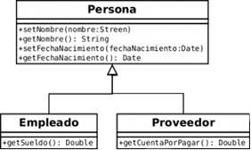
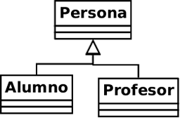

# Investigación 
## Paradigma orientado a objetos
## Índice
[Paradigma orientado a objetos](#paradigma-orientado-a-objetos)  
[Paradigma en el contexto de lenguajes de programación](#paradigma-en-el-contexto-de-lenguajes-de-programación)  
[Programación Orientada a Objetos](#programación-orientada-a-objetos)  
[Abstracción](#abstracción)  
[Encapsulamiento](#encapsulamiento)  
[Herencia](#herencia)  
[Lenguaje de Modelado Unificado](#lenguaje-de-modelado-unificado)  
[UML de una máquina que vende productos](#uml-de-una-máquina-que-vende-productos)  
  
### Paradigma orientado a objetos 
***
La programación orientada a objetos o POO es un paradigma de programación que usa objetos y sus interacciones, para diseñar aplicaciones y programas de computadoras. Está basado en varias técnicas, incluyendo herencia, abstracción, polimorfismo y encapsulamiento.    
      
Un paradigma de programación representa un enfoque particular o filosofía para la construcción del software. No es mejor uno que otro, sino que cada uno tiene ventajas y desventajas.  
  
En la POO las entidades centrales son los objetos, que son tipos de datos que encapsulan con el mismo nombre estructuras de datos, operaciones o algoritmos que manipulan esos datos.[^1]  

[^1]:Miguel Martínez Martínez y Raul Romero Mañuz, ed. (s/f). [«La programación orientada a objetos»](http://dis.um.es/~lopezquesada/documentos/IES_1415/IAW/curso/UT3/ActividadesAlumnos/java7/paginas/pag1.html)  

  
### Paradigma en el contexto de lenguajes de programación
***
Existen muchos paradigmas de programación diferentes, cada uno de ellos tiene sus propias características y tratan de solucionar los problemas clásicos del desarrollo de software desde diferentes perspectivas y filosofías.  
  
Los paradigmas de programación solo son propuestas tecnológicas adoptadas por la Comunidad de desarrolladores que se enfocan a resolver uno o varios problemas definidos y delimitados. Existen muchos paradigmas de programación diferentes, posiblemente el más ampliamente utilizado hoy en día sea el de la programación orientada a objetos.  
  
Algunos lenguajes de programación pueden soportar múltiples paradigmas de programación. Por ejemplo, C++ puede ser empleado para desarrollar software utilizando para ello un modelo de programación puramente orientado a objetos o bien puramente estructurado.  
  
Otros lenguajes han sido diseñados para soportar un único paradigma de programación, ese es el caso de Smalltalk que soporta únicamente la programación orientada a objetos o Haskell que solo soporta la programación funcional.  
  
Es común el diseño de lenguajes que soporten múltiples paradigmas de programación. Estos lenguajes son aquellos que soportan al menos dos paradigmas:  
  
- **Scala:** Imperativo, orientado a objetos, funcional, genérico y concurrente  
- **Erlang:** Funcional, orientado a objetos y funcional  
- **Perl:** Imperativo, orientado a objetos y funcional  
- **PHP:** Imperativo, orientado a objetos, funcional y reflexivo  
- **JavaScript:** Imperativo, orientado a objetos (prototipos) y funcional  
- **Java:** Imperativo, orientado a objetos, reflexivo y genérico  
- **Python y Ruby:** Imperativo, orientado a objetos, reflexivo y funcional  
- **C++:** Imperativo, orientado a objetos, funcional y genérico  
- **C#:** Imperativo, orientado a objetos, funcional (lambda), reflexivo y genérico  
- **Lisp:** Orientado a objetos, funcional y declarativo  
- **Prolog:** Lógico y declarativo  
Estos son algunos ejemplos, existen lenguajes como Oz que soporta nueve paradigmas de programación.  
  
Paradigmas de programación  
  
Un paradigma define un conjunto de reglas, patrones y estilos de programación que son usados por un grupo de lenguajes de programación.  
  
Cada lenguaje tiene sintaxis y semántica:  
  
- La sintaxis de un lenguaje de programación está relacionada con la forma de los programas, por ejemplo, las expresiones, comandos, declaraciones, etc. son puestos juntos en un programa.  
- La semántica de un lenguaje de programación está relacionada con el significado de los programas, por ejemplo, cómo se comportarán cuando se ejecutan en una computadora.  
La sintaxis de un lenguaje influye en cómo los programas son escritos por el programador, leídos por otro programador y traducidos por el computador. La semántica de un lenguaje determina como los programas son compuestos por el programador, entendidos por otros programadores e interpretados por el computador.[^2]
[^2]: GSITIC, ed. (22 diciembre, 2017). [«Lenguajes y paradigmas actuales de programación»](https://gsitic.wordpress.com/2017/12/22/bii4-lenguajes-y-paradigmas-actuales-de-programacion-caracteristicas-tecnicas/)   
  
  
### Programación Orientada a Objetos
***
La programación orientada a objetos es un modelo de programación en el que el diseño de software se organiza alrededor de datos u objetos, en vez de usar funciones y lógica. Se enfoca en los objetos que los programadores necesitan manipular, en lugar de centrarse en la lógica necesaria para esa manipulación. Un objeto se puede definir como un campo de datos con atributos y comportamientos únicos.  
  
Por tanto, la principal característica de este tipo de programación es que soporta objetos, que tienen un tipo o clase asociado. Esas clases pueden heredar atributos de una clase superior o superclase. Por esa razón, este enfoque de programación se utiliza en programas grandes y complejos que se deben actualizar con cierta regularidad.  

Ventajas de la programación orientada a objetos:  
  
- Reutilización del código heredado. Cuando se diseñan correctamente las clases, se pueden usar en distintas partes del programa y en diferentes proyectos. La técnica de herencia ahorra tiempo porque permite crear una clase genérica y luego definir las subclases que heredarán los rasgos de la misma, de manera que no es necesario escribir esas funciones de nuevo. Además, al aplicar un cambio en la clase, todas las subclases lo adoptarán automáticamente.  
  
- Mayor modificabilidad. Otra de las ventajas de la programación orientada a objetos es que permite añadir, modificar o eliminar nuevos objetos o funciones fácilmente para actualizar los programas, lo cual implica un ahorro de tiempo y esfuerzo para los programadores.  
  
- Facilidad para detectar errores en el código. En los lenguajes de programación orientada a objetos no es necesario revisar línea por línea del código para detectar un error. Gracias a la encapsulación los objetos son autónomos, de manera que es más fácil abstraer un problema y saber dónde buscar el error cuando algo no funciona bien.  
  
- Modularidad. Una de las características de la programación orientada a objetos más interesantes es la modularidad ya que así un equipo puede trabajar en múltiples objetos a la vez mientras se minimizan las posibilidades de que un programador duplique la funcionalidad de otro. El trabajo modular también permite dividir los problemas en partes más pequeñas que se pueden probar de manera independiente.  
  
- Flexibilidad gracias al polimorfismo. El polimorfismo de la programación orientada a objetos permite que una sola función pueda cambiar de forma para adaptarse a cualquier clase donde se encuentre. De esta forma se ahorra tiempo de programación y se gana en versatilidad.[^3]  
[^3]: Universidad Europea, ed. (24 agosto, 2022). [«Programación orientada a objetos»](https://universidadeuropea.com/blog/programacion-orientada-objetos/)  
  
  
#### ¿Cuál fue el primer lenguaje orientado a objetos, quienes y en dónde lo propusieron? 
Smalltalk es considerado el primero de los lenguajes orientados a objetos, aunque en realidad el primero en implementar programación orientada a objetos fue Simula. En Smalltalk todo es un objeto, incluidos los números reales o el propio entorno Smalltalk.  
  
Propuesto en 1980, Smalltalk es el primer lenguaje orientado a objetos disponible con un entorno de desarrollo gráfico integrado. Smalltalk fue diseñado por el equipo del americano Alan Kay, del centro de investigación informática californiana de XEROX (el famoso Palo Alto Research Center).[^4]
[^4]: Éditions ENI, ed. (s/f). [«Historia de la POO»](https://www.ediciones-eni.com/open/mediabook.aspx?idR=dbba30cf4ffac2993c1495a629f282df)  
  
Como lenguaje tiene las siguientes características:  
  
- Orientación a Objetos  
- Tipado dinámico  
- Interacción entre objetos mediante envío de mensajes  
- Herencia simple y con raíz común  
- Reflexión computacional completa  
- Recolección de basura  
- Compilación en tiempo de ejecución o Interpretado (dependiendo de la distribución o del proveedor)  
- Múltiples Implementaciones  
  
Smalltalk ha tenido gran influencia sobre otros lenguajes como Java o Ruby, y de su entorno han surgido muchas de las prácticas y herramientas de desarrollo promulgadas actualmente por las metodologías ágiles (refactorización, desarrollo incremental, desarrollo dirigido por tests, etc.).[^5]
[^5]: Wikipedia, ed (23 diciembre, 2022). [«Smalltalk»](https://es.wikipedia.org/wiki/Smalltalk)  
  
  
### Abstracción
***
La abstracción es aquella eliminación de información no relevante en un contexto en específico, así pues, la abstracción capta aquellas funciones y características que se desempeña mejor un cierto objeto. Entonces, dependiendo del problema a solucionar, se escogen y usan tales funciones y características que puedan satisfacer dicho problema, puesto que es lo necesario para poder solucionarlo.  
  
#### ¿Por qué se considera fundamental en programación? 
La abstracción nos permite crear un modelo conceptual de un objeto o concepto y luego utilizar ese modelo para crear objetos más específicos que heredan las características y comportamientos del modelo conceptual. Esto nos permite reutilizar código y simplificar la creación de objetos complejos.[^6]
[^6]: Cursosdesarrolloweb, ed (24 diciembre, 2022). [<«Abstracción en la programación orientada a objetos»](https://www.cursosdesarrolloweb.es/blog/abstraccion-programacion-orientada-objetos#:~:text=La%20abstracci%C3%B3n%20nos%20permite%20crear,la%20creaci%C3%B3n%20de%20objetos%20complejos.)  
  
    
### Encapsulamiento
***
El encapsulamiento es un mecanismo por el cual la información que tenemos contenida en un objeto puede ser solamente usada a partir de servicios que nosotros especificamos, asi pues el encapsulamiento nos permite proteger dicha información de modificaciones externas y no deseadas. Asi también como que el uso de esta información puede ser usada en la circunstancia en que nosotros queramos.  
  
ㅤㅤㅤㅤㅤㅤㅤㅤㅤㅤ[^7][^8]
[^7]: João Henrique, ed (10 noviembre, 2020). [«POO: ¿Qué es la programación orientada a objetos?»](https://www.aluracursos.com/blog/poo-que-es-la-programacion-orientada-a-objetos)
[^8]: Grupo Codesi, ed (s/f). [«Encapsulamiento en Java»](https://www.buscaminegocio.com/cursos-de-java/encapsulamiento-java.html)
  
#### Importancia y problemas que puede evitar
El aislamiento protege a los datos asociados a un objeto contra su modificación por quien no tenga derecho a acceder a ellos, eliminando efectos secundarios e interacciones.  
  
De esta forma el usuario de la clase puede obviar la implementación de los métodos y propiedades para concentrarse sólo en cómo usarlos. Por otro lado se evita que el usuario pueda cambiar su estado de maneras imprevistas e incontroladas.  
  
### Herencia
***
La herencia es el mecanismo por el cual una clase permite que otras clases hereden sus atributos y métodos, de forma que se reutiliza código y hace los procesos más fáciles y rápidos, en vez de reescribir el mismo código varias veces. Esto hará nuestro código mas legible y práctico.  
  
  ㅤㅤㅤㅤㅤㅤㅤㅤㅤㅤㅤㅤㅤㅤㅤㅤㅤ[^9]
[^9]:  Comunidad Java User Group - Nicaragua, ed (24 de noviembre, de 2019). [«¿Por qué utilizar composición sobre la herencia en POO?»](https://jugnicaragua.org/composicion-sobre-la-herencia/)
  
## UML: Diagrama de clases
El lenguaje UML comenzó a gestarse en octubre de 1994 [1], cuando Rumbaugh se unió a la compañía Rational fundada por Booch (dos reputados investigadores en el área de metodología del software). El objetivo de ambos era unificar dos métodos que habían desarrollado: el método Booch y el OMT (Object Modelling Tool ). El primer borrador apareció en octubre de 1995. En esa misma época otro reputado investigador, Jacobson, se unió a Rational y se incluyeron ideas suyas. Estas tres personas son conocidas como los “tres amigos”. Además, este lenguaje se abrió a la colaboración de otras empresas para que aportaran sus ideas. Todas estas colaboraciones condujeron a la definición de la primera versión de UML.  

Esta primera versión se ofreció a un grupo de trabajo para convertirlo en 1997 en un estándar del OMG (Object Management Group). Este grupo, que gestiona estándares relacionados con la tecnología orientada a objetos (metodologías, bases de datos objetuales, 
CORBA, etc.), propuso una serie de modificaciones y una nueva versión de UML (la 1.1), que fue adoptada por el OMG como estándar en noviembre de 1997. Desde aquella versión han habido varias revisiones que gestiona la OMG Revision Task Force. La última 
versión aprobada es la 1.4. En estos momentos se está desarrollando una nueva versión en la que se incluirán cambios importantes (principalmente añadir nuevos diagramas) que conducirán a la versión 2.0 planificada para fines del 2002.  

Tal como indica su nombre, UML es un lenguaje de modelado. Un modelo es una simplificación de la realidad. El objetivo del modelado de un sistema es capturar las partes esenciales del sistema. Para facilitar este modelado, se realiza una abstracción y se plasma en una notación gráfica. Esto se conoce como modelado visual. El modelado visual permite manejar la complejidad de los sistemas a analizar o diseñar. De la misma forma que para construir una choza no hace falta un modelo, cuando se intenta construir un sistema complejo como un rascacielos, es necesario abstraer la complejidad en modelos que el ser humano pueda entender. UML sirve para el modelado completo de sistemas complejos, tanto en el diseño de los sistemas software como para la arquitectura hardware donde se ejecuten. Otro objetivo de este modelado visual es que sea independiente del lenguaje de implementación, de tal forma que los diseños realizados usando UML se pueda implementar en cualquier lenguaje que soporte las posibilidades de UML (principalmente lenguajes orientados a objetos).  
  
Aunque UML está pensado para modelar sistemas complejos con gran cantidad de software, el lenguaje es los suficientemente expresivo como para modelar sistemas que no son informáticos, como flujos de trabajo (workflow ) en una empresa, diseño de la estructura de una organización y por supuesto, en el diseño de hardware.  
   
En los últimos años, el uso de diagramas de clases aún es utilizado, en las escuelas donde se enseña programación orientada a objetos es un tema bien implementado en los temarios.   
  
Incluso hay empresas que usan esta herramienta para la creación de diferentes tipos de soluciones a alguna problemática que se requiera de una solución.  

### Herramientas para el modelado en UML
***
[Web] Lucidchart:  Es una herramienta muy completa; ya que no solamente podrás crear diagramas UML, sino múltiples diseños como: wireframes, canvas, redes de datos, entre otros. Adicionalmente cuenta con licencias gratuitas, de costo y académicas.
[Web] Diagrams: Una de las peculiaridades que posee, es la capacidad de respaldar tus diagramas en diferentes fuentes coo: google drive, github, dropbox,one drive. Es una buenisima herramienta puedes crear infinidad de diagramas y/o diseños de: redes, negocios, software, infografias, iconos,etc
[Web] Cacoo: Es una herramienta de diseño colaborativo. Es de costo y tiene su versión gratuita. Contribuye a la lluvia de ideas y mejora continua de productos. Permite trabajar con diseños de AWS, Visio y multiples integraciones como: Google drive, Adobe Creative Cloud y Confluence
[MacOS, Windows, Linux] StarUML: Todo un clásico, enfocado en el diagramado UML ágil. Cuenta con manejo de extensiones en distintos lenguajes de programación , generación de código de programación, entre otros
[MacOS, Windows, Linux] Papyrus: Un complemento perfecto si estas trabajando con el IDE Eclipse; ya que además de permitirte diseñar tus diagramas los podrás implementar en un entorno de programación. Contiene herramientas para visualizar la ejecución en tiempo real de tus diagramas
[MacOS, Windows, Linux] Modelio: Tiene un amplio soporte de modelado en: UML, BPMN, ArchiMate,SysML. Puedes realizar ingenieria inversa para crear tus diagramas, entre muchas otras funcionalidades.
[MacOS, Windows, Linux] UMLDesigner: Una herramienta muy completa con amplio soporte de lenguajes de programación e interfaz con muy buen usabilidad
[Web] GenmyModel:  Buenisima herramienta web para modelar datos, te permite crear diagramas UML,BPMN, ArchiMate, Journey Mapping, diagramas de flujo y muchas más.
[Web] Gliffy:  Es una herramienta muy completa, posee integración con una de las mejores plataformas de gestión de proyectos del mercado Atlassian, lamentablemente tiene un  costo, pero si esta entre tus posibilidades esta deberia una opción
[Web] Diagramo: Es una herramienta desarrollada en HTML5 , permite colaborar, exportar tus diseños en distintos formatos y apoyarte en los distintos diagramas que son creados continuamente en la comunidad.
[Web] BPMN: Es una herramienta netamente basada en el modelado de negocios, creación de reglas de negocio. Requiere un expertise en programación, debido a las funcionalidades de adaptación y creación que posee.
[Windows] UMLet: Quizá no sea la herramienta más bonita visualmente, pero te puede sacar de cualquier apuro que tengas al momento de crear tus diagramas UML. Una de sus caracteristicas destacables es la documentación que te ayuda paso a paso en tus diseños.
[Web]Verbatelo: Amplio soporte con bases de datos como: Oracle 11g,MySQL 5.5,PostgreSQL 9.x,SQLite 3.7.x,IBM DB2 9.7,MS SQL Server,HSQLDB 2.3,Amazon Redshift. Permite colaborar en equipo, aplicar ingenieria inversa, generar archivos SQL y muy buena usabilidad.Tiene costo económico,pero si eres estudianteo o profesor la herramienta la podrás utilizar gratis.
[MacOS, Windows, Linux] xUML: Es una muy buena herramienta con apoyo de la comunidad. Utiliza lenguaje acción objeto como parte indispensable para acceso a datos, generación de eventos,pruebas, transformaciones,etc. Posee un compilador del modelo con soporte en C y C++
[Web, Windows, Linux,MacOS]Umple:Es una herramienta de modelado y una familia de lenguajes de programación que permite lo que llamamos Programación Orientada a Modelos. Añade abstracciones como Asociaciones, Atributos y Máquinas de Estado derivadas de UML a lenguajes de programación orientados a objetos como Java, C++, PHP y Ruby.
### Lenguaje de Modelado Unificado
***
### UML de una máquina que vende productos  
***
### Referencias